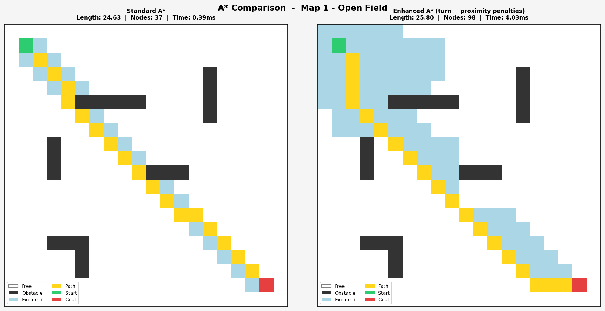
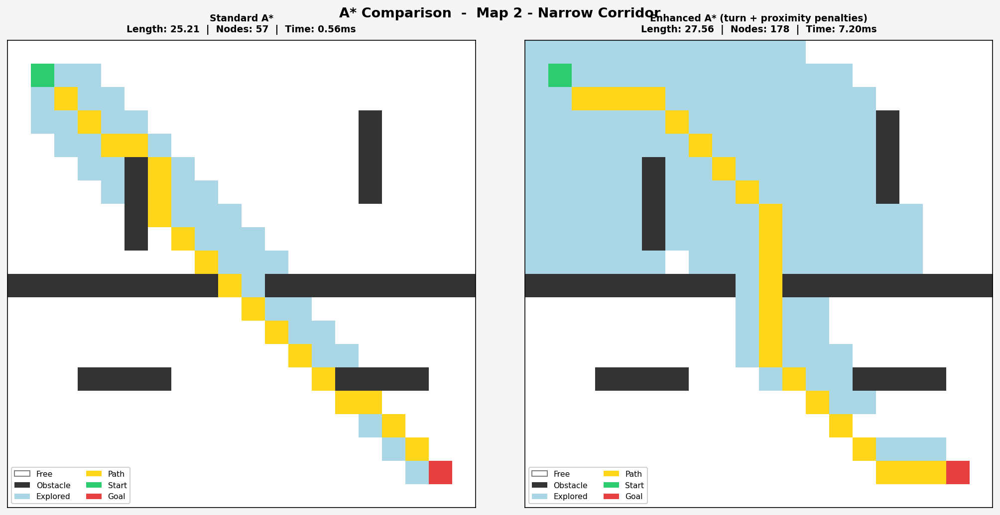
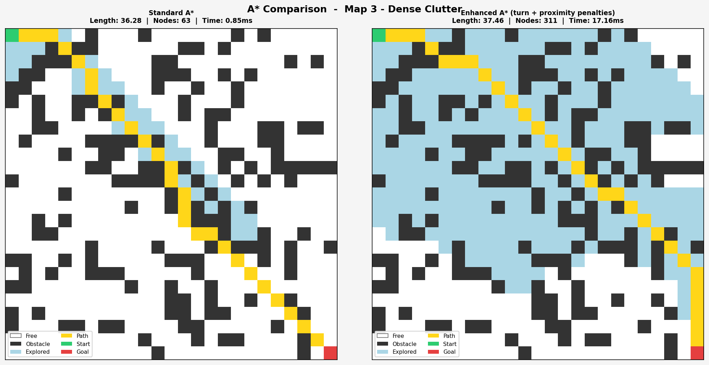

# Shortest Path Finder
### Comparative Analysis of Standard A\* vs Enhanced A\* Pathfinding

Course project for **Intro to Algorithms** — compares two versions of the A\* search algorithm on 2D grid environments.

---

## 🚀 Live Demo

**[](https://share.streamlit.io/mahin1-coder/path-finder/main/app.py)**

> No installation needed — runs entirely in the browser.
> Select a map, adjust penalty settings, and click **Run** to compare both algorithms live.

---

## What it does

- Implements **Standard A\*** using octile distance heuristic
- Implements **Enhanced A\*** with two extra cost penalties:
  - **Turn penalty** — discourages sharp direction changes, producing smoother paths
  - **Proximity penalty** — steers the path away from walls for safer clearance
- Runs both on 3 different test maps and compares:
  - Path length
  - Number of nodes expanded
  - Computation time

---

## How to run

**Option 1 — Live in browser (no install):**
Visit the live demo link at the top ☝️

**Option 2 — Run locally:**
```bash
pip install numpy matplotlib streamlit
streamlit run app.py
```

Output figures are also saved to the `results/` folder when running `main.py` directly:
```bash
python3 main.py
```

---

## Results

> Click any image to open the full-size view, or use the direct links below.

**[🔗 View All Results on GitHub](https://github.com/mahin1-coder/path-finder/tree/main/results)**

| Map | Direct Link |
|---|---|
| Map 1 — Open Field | [View](https://github.com/mahin1-coder/path-finder/blob/main/results/Map_1_-_Open_Field.png) |
| Map 2 — Narrow Corridor | [View](https://github.com/mahin1-coder/path-finder/blob/main/results/Map_2_-_Narrow_Corridor.png) |
| Map 3 — Dense Clutter | [View](https://github.com/mahin1-coder/path-finder/blob/main/results/Map_3_-_Dense_Clutter.png) |

### Map 1 — Open Field (20×20)
[](https://github.com/mahin1-coder/path-finder/blob/main/results/Map_1_-_Open_Field.png)

### Map 2 — Narrow Corridor (20×20)
[](https://github.com/mahin1-coder/path-finder/blob/main/results/Map_2_-_Narrow_Corridor.png)

### Map 3 — Dense Clutter (25×25)
[](https://github.com/mahin1-coder/path-finder/blob/main/results/Map_3_-_Dense_Clutter.png)

---

## Sample Console Output

```
=======================================================
  Map 1 - Open Field  |  Grid: 20x20  |  Start: (1,1)  Goal: (18,18)
=======================================================
  Metric                     Standard A*     Enhanced A*
  ----------------------------------------------------
  Path length                     24.627          25.799
  Nodes expanded                      37              98
  Time (ms)                        0.389           4.025

  Delta path length : +1.172
  Delta nodes       : +61
```

---

## File Structure

| File | Description |
|---|---|
| `app.py` | **Streamlit web app** (live interactive demo) |
| `main.py` | Runs all experiments locally and prints results |
| `astar.py` | Standard A* implementation |
| `enhanced_astar.py` | Enhanced A* with turn + proximity penalties |
| `utils.py` | Grid helpers, Node class, test maps |
| `visualization.py` | Matplotlib side-by-side comparison plots |

---

## Color Legend

| Color | Meaning |
|---|---|
| ⬜ White | Free cell |
| ⬛ Dark | Obstacle |
| 🟦 Blue | Explored (expanded) nodes |
| 🟨 Yellow | Final path |
| 🟩 Green | Start position |
| 🟥 Red | Goal position |
